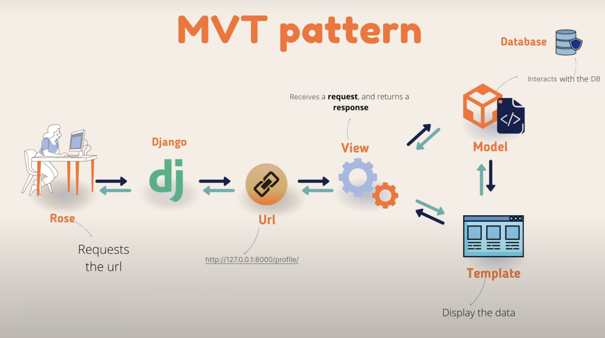

# Django

### What is Framework?

- In programming, a framework is a collection of software modules and  reusable tools, like a foundation or template, that provides pre-built components and functionalities to simplify and accelerate software development. 

- It offers a standardized way to build applications, allowing developers to focus on higher-level design and business logic rather than low-level tasks. 

### What is Django?

- Django is a free, open-source, high-level web framework written in Python.

- It is designed to facilitate rapid development of robust and scalable web applications, emphasizing reusability and "don't repeat yourself" (DRY) principles. 

### Key features of Django include:

- **Model-Template-View (MTV) Architecture :** Similar to the Model-View-Controller (MVC) pattern, Django separates data (Models), presentation (Templates), and business logic (Views) for better organization and maintainability.

- **Object-Relational Mapper (ORM) :** Django's built-in ORM allows developers to interact with databases using Python objects instead of writing raw SQL queries, simplifying database operations. 

- **Built-in Admin Interface :** Django provides an automatically generated, customizable administrative interface for managing application data, significantly speeding up development of back-end functionalities.

- **Authentication System :** It includes a comprehensive and secure user authentication system, handling user accounts, permissions, and password management.

- **Security Features :** Django incorporates built-in protections against common web vulnerabilities like SQL injection, cross-site scripting (XSS), cross-site request forgery (CSRF), and clickjacking.

- **Scalability :** Django is designed to be highly scalable, capable of handling high traffic demands and complex applications used by major websites.

- **Versatility :** It can be used to build a wide range of web applications, including content management systems, social networks, e-commerce platforms, and more.

### Virtual Environment : 

- A Python virtual environment is an isolated, self-contained directory that houses a specific Python interpreter and its own set of installed packages and dependencies. 

- It acts as a dedicated workspace for a single Python project, preventing conflicts and ensuring project-specific requirements are met without affecting other projects or the system-wide Python installation.

### About Project Structure :

- `manage.py` : A command-line utility that lets you interact with the Django project in various ways.

- `mysite/` : A directory that is the actual Python package for your project. Its name is the Python package name you’ll need to use to import anything inside it (e.g. mysite.urls).

- `mysite/__init__.py` : An empty file that tells Python interpreter, that this directory should be considered a Python package. If this file is deleted we cannot import modules from one package to another.

- `mysite/settings.py` : Settings/configuration for this Django project.

- `mysite/urls.py` : The URL(Universal Resource Locator) declarations for this Django project; a “table of contents” of your Django-powered site.

- `mysite/asgi.py` : Asynchronous Server Gateway Interface is an entry-point for ASGI-compatible web servers to serve your project. Works similar to `wsgi.py` but comes with additional functionality.

- `mysite/wsgi.py` : Web Server Gateway Interface file is used while deploying our application in production server. It's an entry-point for WSGI-compatible web servers to serve your project. A specification file that describes how the servers should interact with the web applications.

### Working of Django

- Django follows MVT(Model, View, Template) software design pattern.



- The design pattern is the way of defining the rules of developing software application.

### Creating a project

**Bootstrap a new Django project :**
```bash
django-admin startproject <project_name>
```

**To run the development server :**
```bash
python manage.py runserver
```

**To create an app :**
```bash
python manage.py startapp <app_name>
```

### NOTE : Projects vs apps 

- An app is a web application that does something – e.g., a blog system, a database of public records or a small poll app. 

- A project is a collection of configuration and apps for a particular website. A project can contain multiple apps. An app can be in multiple projects.

**To login to admin dashboard, create a super user and set the username and password :**
```bash
python manage.py createsuperuser
```

**For changing the password of super user :**
```bash
python manage.py changepassword <your_user_name>
```

### Database Migrations : 

**Step 1 :** Reads the `models.py` file, looks for any changes and creates a migration file
```bash
python manage.py makemigrations
```

**Step 2 :** This will execute the SQL commands present in the migration file.
```bash
python manage.py migrate
```

### Media files :

- Files uploaded by the user is called as the media files.

- Add the following piece of code in `settings.py` :
```py
# Media files configuration
MEDIA_URL = '/media/'
MEDIA_ROOT = BASE_DIR / 'media'
```

- `urls.py` :
```py
from django.conf import settings
from django.conf.urls.static import static

urlpatterns = [...] + static(settings.MEDIA_URL, document_root=settings.MEDIA_ROOT)
```